<p align="center">
  
  
  
  
  
  
</p>

<h1 align="center">🔮 AstraRAG — Agentic Multi-Agent RAG Chatbot</h1>

<p align="center">
  <strong>A production-grade, multi-agent Retrieval-Augmented Generation system</strong><br/>
  <em>4 specialized AI agents working in a coordinated pipeline to deliver fact-checked, source-grounded, conversationally-formatted answers from your documents.</em>
</p>

<p align="center">
  <a href="#-architecture--multi-agent-pipeline">Architecture</a> •
  <a href="#-key-features">Features</a> •
  <a href="#-tech-stack">Tech Stack</a> •
  <a href="#%EF%B8%8F-getting-started">Setup</a> •
  <a href="#-deployment">Deploy</a>
</p>

---

## 📌 Problem Statement

Traditional chatbots generate **hallucinated** or **inaccurate** responses due to:
- Limited context awareness and no access to private domain knowledge
- Static RAG pipelines that lack multi-step reasoning capabilities
- No verification layer — answers go unchecked before reaching the user
- Robotic, unformatted outputs that provide poor user experience

## 💡 Solution

AstraRAG solves these challenges with a **4-agent orchestrated pipeline** that retrieves, summarizes, verifies, and humanizes every response:

```
📄 Upload PDF → 🧩 Chunk & Embed → 🔍 Semantic Search → 🤖 4-Agent Pipeline → ✅ Verified Answer
```

Each agent has a distinct role, clear goal, and specialized behavior — mimicking how a real-world expert team operates on a knowledge task.

---

## 🧠 Architecture — Multi-Agent Pipeline

> **This is the core differentiator.** Unlike single-agent systems, AstraRAG decomposes the reasoning process into 4 autonomous, cooperative agents orchestrated via [CrewAI](https://github.com/crewAIInc/crewAI).

```mermaid
graph LR
    A["🧑 User Query"] --> B["🔍 QA Agent<br/><em>Retrieves context from docs</em>"]
    B --> C["📝 Summarizer Agent<br/><em>Condenses & refines</em>"]
    C --> D["✅ Fact-Checker Agent<br/><em>Validates against sources</em>"]
    D --> E["💬 Response Formatter<br/><em>Humanizes output</em>"]
    E --> F["🎯 Final Response<br/><em>+ Sources + Suggestions</em>"]
    style B fill:#3b82f6,stroke:#2563eb,color:#fff
    style C fill:#8b5cf6,stroke:#7c3aed,color:#fff
    style D fill:#ef4444,stroke:#dc2626,color:#fff
    style E fill:#a855f7,stroke:#7c3aed,color:#fff
    style F fill:#34d399,stroke:#059669,color:#000
```



### Agent Breakdown

| # | Agent | Role | Responsibilities | Key Config |
|---|-------|------|------------------|------------|
| 1 | **QA Agent** | Question Answer Agent | Retrieves context from the vector store via `rag_query_tool`, then constructs an evidence-based answer. **Never answers from memory.** | `temp=0.1`, `max_iter=5`, RAG tool |
| 2 | **Summarizer Agent** | Expert Editor | Condenses the raw QA output into clear, concise summaries while preserving key takeaways and context. | `temp=0.1`, no tools |
| 3 | **Fact-Checker Agent** | Senior Hallucination Auditor | Cross-references every claim against source documents. Rejects hallucinated content with zero tolerance. | `temp=0.1`, `max_iter=3`, RAG tool |
| 4 | **Response Formatter** | Conversational UX Specialist | Transforms verified answers into warm, professional, well-formatted responses with follow-up suggestions and confidence indicators. | `temp=0.3`, no tools |

### Why Multi-Agent?

| Single-Agent Approach | AstraRAG Multi-Agent Approach |
|----------------------|-------------------------------|
| One model does everything — retrieval, reasoning, formatting | Each agent specializes in one task → **higher accuracy** |
| No verification — hallucinations pass through | Dedicated Fact-Checker agent catches hallucinations |
| Raw, unformatted output | UX Specialist formats responses conversationally |
| Fixed behavior, hard to extend | Modular — add/remove/swap agents independently |

---

## ✨ Key Features

### Intelligent Document Processing
- **PDF Upload & Ingestion** — Automatic chunking, embedding, and vector indexing
- **Semantic Search** — Similarity-based retrieval via ChromaDB vector store
- **Source Attribution** — Every answer cites the exact documents used

### Multi-Agent Reasoning
- **4-Agent Pipeline** — Retrieval → Summarization → Fact-Checking → Formatting
- **Hallucination Prevention** — Dedicated agent audits every claim against source material
- **Autonomous Agent Execution** — Agents plan, reason, and act independently via CrewAI
- **Configurable LLM Backend** — Supports both OpenAI GPT and Google Gemini models

### User Experience
- **Confidence Indicators** — 🟢 High / 🟡 Medium / 🔴 Low confidence badges
- **Follow-Up Suggestions** — AI-generated topic-relevant follow-up questions as clickable chips
- **Source Chips** — Referenced documents displayed as interactive badges
- **Auditor Insights** — Expandable panel showing fact-check rationale and agent pipeline details
- **Real-time Status** — Live system health monitoring (Online/Offline indicator)
- **Responsive UI** — Mobile-optimized Streamlit interface with custom dark theme

### Production-Ready Backend
- **RESTful API** — FastAPI with health checks, document management, and chat endpoints
- **Document Management** — Upload, list, and delete documents via API
- **Persistent Vector Store** — ChromaDB with persistent storage for indexed documents
- **Error Handling** — Graceful degradation with meaningful error messages

---

## 🛠️ Tech Stack

| Layer | Technology | Purpose |
|-------|-----------|---------|
| **Agent Orchestration** | CrewAI v1.14 | Multi-agent pipeline coordination, task delegation & sequential execution |
| **RAG Framework** | LlamaIndex v0.14 | Document ingestion, vector store indexing, semantic query engine |
| **Vector Database** | ChromaDB v1.1 | Persistent vector storage for document embeddings |
| **Embedding Model** | BAAI/bge-small-en-v1.5 | HuggingFace sentence embeddings for chunked documents |
| **LLM** | Google Gemini / OpenAI GPT | Configurable LLM backend for all agents (via `.env`) |
| **Backend** | FastAPI + Uvicorn | Async REST API server with auto-docs at `/docs` |
| **Frontend** | Streamlit | Real-time chat UI with custom CSS theming |
| **Deployment** | Docker + Render | Containerized deployment with `Dockerfile` + `render.yaml` |

---

## 📁 Project Structure

```
AstraRAG-Agentic-RAG-Chatbot/
│
├── src/
│   ├── agents_src/                    # 🤖 Multi-Agent System
│   │   ├── agents/
│   │   │   ├── question_answer_agent.py    # Agent 1: RAG-powered QA
│   │   │   ├── summarizer_agent.py         # Agent 2: Content summarizer
│   │   │   ├── fact_checker_agent.py       # Agent 3: Hallucination auditor
│   │   │   └── response_formatter_agent.py # Agent 4: UX formatter
│   │   ├── tasks/
│   │   │   ├── question_answer_task.py     # Task definition for QA
│   │   │   ├── summarizer_task.py          # Task definition for summarization
│   │   │   ├── fact_checker_task.py        # Task definition for fact-checking
│   │   │   └── response_formatter_task.py  # Task definition for formatting
│   │   ├── tools/
│   │   │   └── rag_qa_tool.py              # Custom CrewAI tool (ChromaDB + LlamaIndex)
│   │   ├── config/
│   │   │   └── agent_settings.py           # Pydantic settings for agents & LLM
│   │   ├── llm/                            # LLM configuration
│   │   └── crew.py                         # Crew assembly — 4 agents, 4 tasks
│   │
│   ├── backend_src/                   # ⚡ FastAPI Backend
│   │   ├── api/
│   │   │   ├── chat.py                     # POST /chat — runs the multi-agent crew
│   │   │   └── documents.py                # CRUD endpoints for document management
│   │   ├── services/                       # Business logic layer
│   │   ├── config/                         # Backend configuration
│   │   └── main.py                         # Uvicorn entry point (port 8001)
│   │
│   ├── frontend_src/                  # 🎨 Streamlit Frontend
│   │   ├── app.py                          # Main UI — chat, upload, sidebar
│   │   └── config/                         # Frontend settings
│   │
│   └── rag_doc_ingestion/             # 📥 CLI document ingestion (optional)
│
├── doc_vector_store/                  # 💾 Persistent ChromaDB storage
├── docs_dir/                          # 📄 Uploaded document storage
├── requirements.txt                   # 📦 Python dependencies
└── README.md
```

---

## ⚙️ Getting Started

### Prerequisites

- **Python 3.11+**
- **API Key** — OpenAI (`OPENAI_API_KEY`) or Google Gemini (`GOOGLE_API_KEY`)

### 1. Clone & Setup

```bash
git clone https://github.com/Chamoda-dasanayake/AstraRAG-Agentic-RAG-Chatbot.git
cd AstraRAG-Agentic-RAG-Chatbot
```

### 2. Environment Configuration

```bash
cp .env.example .env
```

Edit `.env` with your API keys:

```env
# Option A: Google Gemini (recommended)
GOOGLE_API_KEY=your_google_api_key
MODEL_NAME=gemini-1.5-flash

# Option B: OpenAI
OPENAI_API_KEY=your_openai_api_key
MODEL_NAME=gpt-4o-mini
```

### 3. Install Dependencies

```bash
python -m venv .venv

# Windows
.venv\Scripts\activate

# macOS/Linux
source .venv/bin/activate

pip install -r requirements.txt
```

### 4. Run

Open **two terminals**:

```bash
# Terminal 1 — Backend API (port 8001)
python -m src.backend_src.main

# Terminal 2 — Frontend UI (port 8501)
streamlit run src/frontend_src/app.py
```

### 5. Verify

```bash
# Health check
curl http://localhost:8001/health
# → {"status": "healthy", ...}
```

Open **http://localhost:8501** → Upload a PDF → Start asking questions!

---

## 🔄 How It Works — End-to-End Flow

```
┌─────────────────────────────────────────────────────────────────┐
│  1. DOCUMENT INGESTION                                          │
│     PDF → PyPDF Parser → Text Chunks → BGE Embeddings → ChromaDB│
├─────────────────────────────────────────────────────────────────┤
│  2. USER QUERY                                                   │
│     User types question in Streamlit chat UI                     │
├─────────────────────────────────────────────────────────────────┤
│  3. MULTI-AGENT PIPELINE (CrewAI Sequential Execution)           │
│                                                                  │
│     ┌──────────────┐                                             │
│     │ QA Agent     │ → Calls rag_query_tool → ChromaDB semantic  │
│     │ (Retriever)  │   search → Top-3 chunks → Evidence answer   │
│     └──────┬───────┘                                             │
│            ▼                                                     │
│     ┌──────────────┐                                             │
│     │ Summarizer   │ → Condenses verbose answer into 2-3 key     │
│     │ (Editor)     │   takeaways while preserving accuracy       │
│     └──────┬───────┘                                             │
│            ▼                                                     │
│     ┌──────────────┐                                             │
│     │ Fact-Checker  │ → Re-queries ChromaDB to cross-reference   │
│     │ (Auditor)     │   claims → Strips hallucinations → Adds    │
│     │               │   rationale + confidence level             │
│     └──────┬───────┘                                             │
│            ▼                                                     │
│     ┌──────────────┐                                             │
│     │ Formatter    │ → Humanizes tone → Adds markdown formatting │
│     │ (UX Expert)  │   → Generates follow-up suggestions        │
│     └──────────────┘                                             │
├─────────────────────────────────────────────────────────────────┤
│  4. RESPONSE                                                     │
│     Formatted answer + confidence badge + source chips +         │
│     follow-up suggestions → Rendered in Streamlit UI             │
└─────────────────────────────────────────────────────────────────┘
```

---

## 🏗️ Engineering Highlights

| Skill Area | Demonstrated In |
|-----------|-----------------|
| **Multi-Agent Systems** | 4-agent CrewAI pipeline with role-based specialization and sequential task delegation |
| **RAG Architecture** | LlamaIndex + ChromaDB end-to-end retrieval pipeline with semantic search |
| **Prompt Engineering** | Carefully crafted agent roles, goals, and backstories for optimal LLM behavior |
| **API Design** | RESTful FastAPI with document CRUD, chat endpoints, and health monitoring |
| **System Design** | Modular architecture — agents, tasks, tools, and services are independently testable |

| **Frontend Engineering** | Custom-themed Streamlit with responsive CSS, animations, and real-time status |
| **AI/ML Integration** | HuggingFace embeddings, configurable LLM backends (Gemini/OpenAI), vector databases |

---

## 🗺️ Roadmap

- [x] Core 3-agent pipeline (QA → Summarizer → Fact-Checker)
- [x] Response Formatter agent (4th agent — conversational UX)
- [x] Confidence indicators and follow-up suggestions
- [x] Document management (upload, list, delete)
- [x] Responsive mobile UI with dark theme
- [ ] Docker containerization & cloud deployment
- [ ] Conversation memory (multi-turn context)
- [ ] Multi-document cross-referencing
- [ ] Agent performance analytics dashboard
- [ ] WebSocket streaming for real-time agent status

---

## 📄 License

MIT License — see [LICENSE](LICENSE) for details.

---

<p align="center">
  <strong>Built with ❤️ using CrewAI, LlamaIndex, FastAPI, and Streamlit</strong><br/>
  <em>Demonstrating multi-agent AI system design, RAG architecture, and full-stack engineering.</em>
</p>
